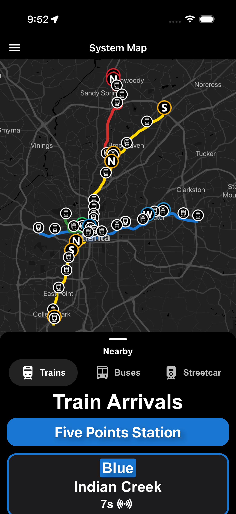
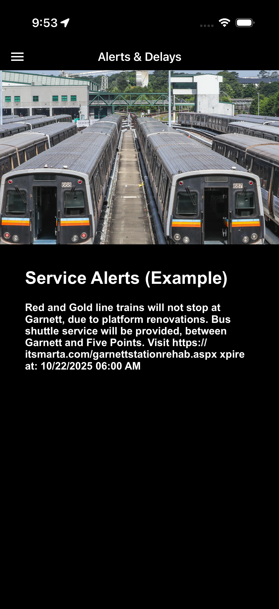

# 🚂 Ride285 🚂

Ride285 is an alternative to the *MARTA On the Go* app, featuring real-time tracking, a more modernized GUI, and native support for both iOS and Android devices. This project was created with [Expo](https://expo.dev) and [React Native](https://reactnative.dev/).

</img> </img>

## Features
- [x] Real-Time Tracking
- [x] System Alerts
- [ ] Widget Support
- [ ] Etc...

## Usage

1. Install dependencies

   ```bash
   npm install
   ```

2. Start the app

   ```bash
   npx expo start
   ```

In the output, you'll find options to open the app in a

- [development build](https://docs.expo.dev/develop/development-builds/introduction/)
- [Android emulator](https://docs.expo.dev/workflow/android-studio-emulator/)
- [iOS simulator](https://docs.expo.dev/workflow/ios-simulator/)
- [Expo Go](https://expo.dev/go), a limited sandbox for trying out app development with Expo

You can start developing by editing the files inside the **app** directory. This project uses [file-based routing](https://docs.expo.dev/router/introduction).

Copyright (c) 2025 Siembra Labs
